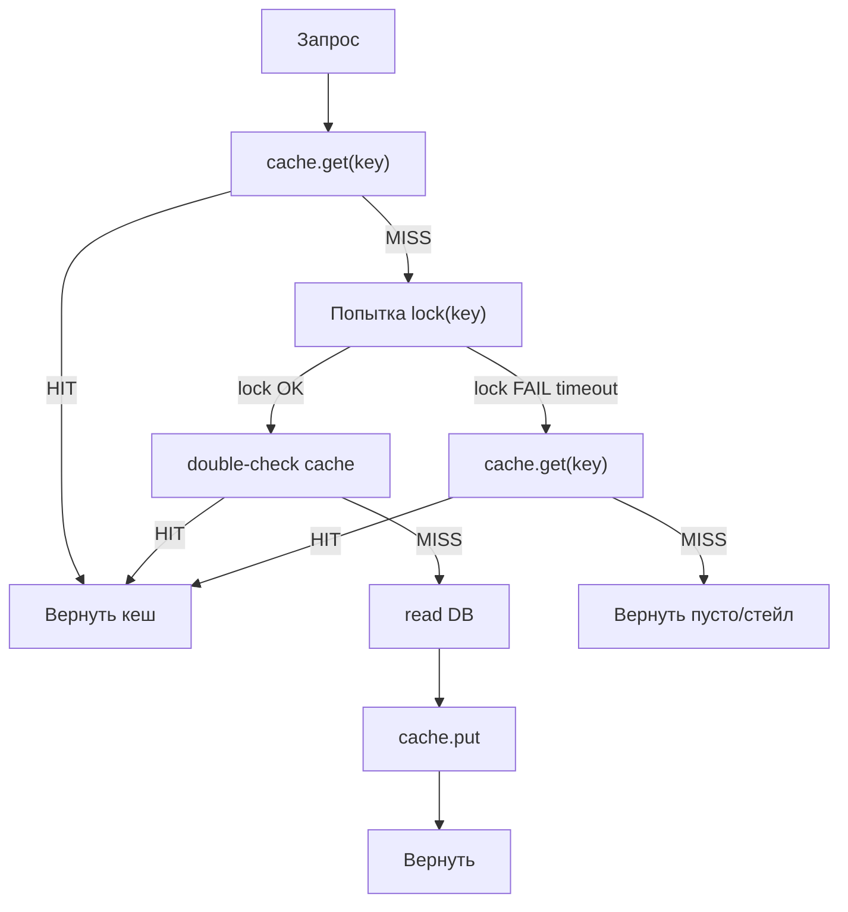
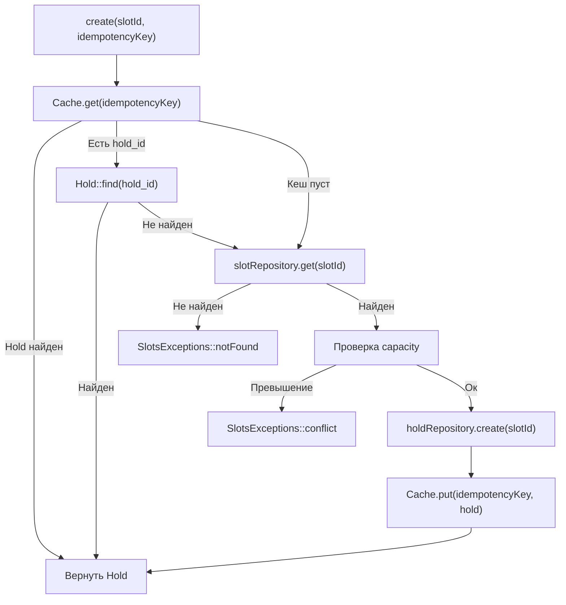

# logistics-booking-api-laravel

Бронирование мест в слотах для перевозок охлажденных грузов

## Развертывание (Docker)

1) Скопируйте переменные окружения:
`cp .env.example .env`

2) Поднимите окружение:
`docker compose -f docker/docker-compose.yml up -d --build`

Приложение будет доступно на `http://localhost:8000` (контейнер запускает `php artisan serve`).

### Доступ к MySQL

- Пользователь приложения: `logist` / `logist_pass`

## Примеры запросов (curl)

Получить доступные слоты:
```
curl -X GET "http://localhost:8000/api/slots/availability"
```

Создать hold для слота (обязателен заголовок `Idempotency-Key` в формате UUID):
```
curl -X POST "http://localhost:8000/api/slots/1/hold" \
  -H "Idempotency-Key: 11111111-1111-1111-1111-111111111111"
```

Подтвердить hold:
```
curl -X POST "http://localhost:8000/api/holds/1/confirm"
```

Отменить hold:
```
curl -X DELETE "http://localhost:8000/api/holds/1"
```

## Миграции и сиды

Запуск миграций:
`docker compose -f docker/docker-compose.yml exec app php artisan migrate`

Сидер наполнит slots:
`docker compose -f docker/docker-compose.yml exec app php artisan db:seed`

## Схема защиты от cache stampede



## Схема защиты от oversale в SlotHolderService

